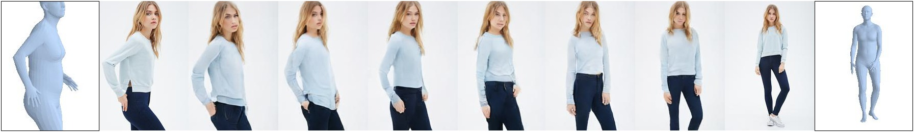
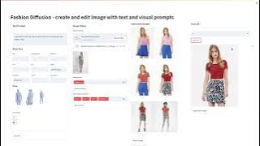
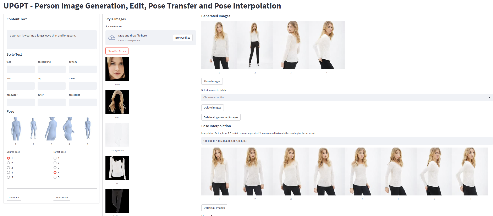

# UPGPT
This is the official Github repo of "**UPGPT**: **U**niversal Diffusion Model for **P**erson Image **G**eneration, Editing and **P**ose **T**ransfer". The first model that could combine all the person image generation functions, and conditioning using pose, text and visual prompts. 

***A follow-up paper has been published, resulting in huge improvement in image quality, check out the [ViscoNet project page](https://soon-yau.github.io/visconet/).***

### Publication:

ICCV Workshop 2023: https://openaccess.thecvf.com/ICCV2023_workshops/CV4Metaverse

Arxiv: https://arxiv.org/abs/2304.08870. 

BibTeX:
```
@InProceedings{Cheong_2023_ICCV,
    author    = {Cheong, Soon Yau and Mustafa, Armin and Gilbert, Andrew},
    title     = {UPGPT: Universal Diffusion Model for Person Image Generation, Editing and Pose Transfer},
    booktitle = {Proceedings of the IEEE/CVF International Conference on Computer Vision (ICCV) Workshops},
    month     = {October},
    year      = {2023},
    pages     = {4173-4182}
```


Simultaneous pose and camera view interpolation via SMPL parameter linear interpolation.



<sub> The code was adapted from https://github.com/Stability-AI/stablediffusion/.</sub>

Featured in [RSIP Vision Newsletter September 2023.](https://www.rsipvision.com/ComputerVisionNews-2023September/3/)


## Video Demo (HD) 
Click on the icon to view demonstration of earlier version of our app on Youtube. 

[](https://youtu.be/2E8MSRlcN54)


## News 

**[2023.12.09]** A follow-up paper has been published, resulting in huge improvement in image quality, check out the [ViscoNet project page](https://soon-yau.github.io/visconet/). 

**[2023.09.25]** Selected for live demo at ICCV 2023 on Friday Oct 6th. https://iccv2023.thecvf.com/demos-111.php

**[2023.09.05]** Featured in RSIP Vision Newsletter September 2023.

**[2023.08.16]** Accepted at 2023 IEEE/CVF International Conference on Computer Vision (ICCV) Workshops.

**[2023.07.27]** Updated Arxiv paper.

**[2023.06.05]** Training data and script released - pose transfer with bounding box as RPM. This concludes all the planned releases.

**[2023.06.01]** I have updated the code for pose interpolation. However, you will need to download the new model file interp_256.zip (previously pt_256.zip). The app now also come with pre-loaded style images and generated examples.


## Paper's Result
The ground truth and generated images used in the paper can be downaloded from
[the repo release.](https://github.com/soon-yau/upgpt/releases/tag/v1.0.0)

## Requirements
A suitable [conda](https://conda.io/) environment named `upgpt` can be created
and activated with:

```
conda env create -f environment.yaml
conda activate upgpt
```
## Files
Model checkpoints and dataset can be downloaded from [HuggingFace](https://huggingface.co/soonyau/upgpt/tree/main). 

## App Demo



This demonstration uses pre-segmented style images from DeepFashion Multimodal dataset and does not support arbitrary images that you upload. We provide a few samples in the app for you to play with. If you want to try more style images, follow instructions in  "Additional Data".
- Download models interp_256.zip and upscale.zip(optional) and unzip into ./models/upgpt
- Start the app by typing in terminal `streamlit run app.py  --server.fileWatcherType none`
- Click "Image Styles->Browse files" to select images from ./fashion. Then "select styles" and click "Show/Get Styles" to extract style images. The model is trained for pose transfer, hence a face style image is advised to produce good result.
- Entering "style text" will override corresponding style images, therefore remove style text if you want to use style image.
 
### Additional data
1. Download and unzip deepfashion_inshop.zip into datasets/deepfashion_inshop.
2. You can try more style images from the DeepFashion Multimodal dataset by downloading and unzip images.zip from [DeepFashion Multimodal dataset](https://github.com/yumingj/DeepFashion-MultiModal). Use this inplace of ./fashion to select fashion images from. Also, run `rm -r app_cache/styles && ln -s deepfashion_inshop/styles app_cache/styles` to link to the full dataset style images. 
 
## Training
There are several configurations proposed in the paper but for simplicity we provide only one config (bounding box as RPM) that can perform both pose transfer and pose interpolation. If you want to compare our result (silhouette mask as RPM), we suggest you to download the generated images (see section "Paper's Result" above).

1. Download and unzip deepfashion_inshop.zip into datasets/deepfashion_inshop.
2. Download deepfashion_256_v2.ckpt and place it in models/first_stage_models/kl-f8-deepfashion
3. Run train.sh, or 

```python main.py -t --base configs/deepfashion/bbox.yaml --gpus 0, --scale_lr False --num_nodes 1```

Checkpoints and generated images will be saved in ./logs.


